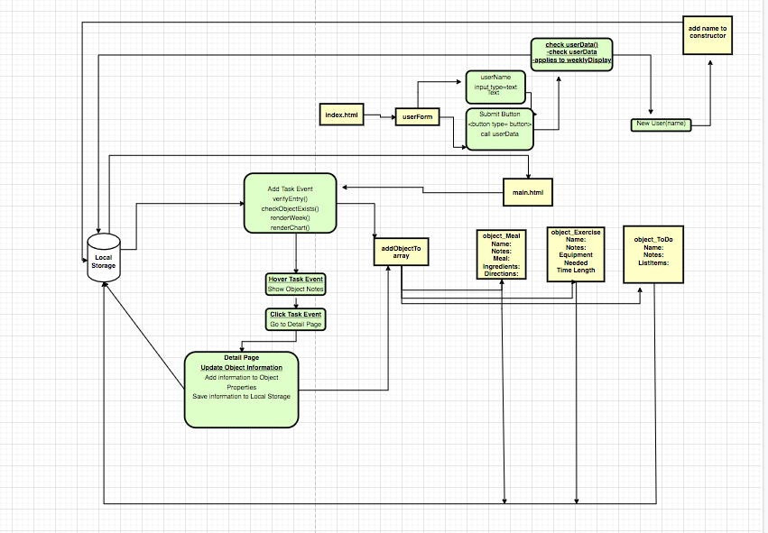

## **Requirements**

### **What is the vision of the product?**

To provide users with a place where they can plan out daily events for a seven day period.

### **What pain point does this project solve?** 

This planner helps the user to stay on track on thier projects, by visually displaying added evests in a 7 day planner. This allows for a more balanced, fulfilling lifestyle.

### **Why should we care about your product?**

- Planning can greatly reduce stress
- Proper planning gives you the peace of mind knowing that you have an action plan emplace
- Planning also helps you be prepared for obstacles and avoids any conflicts with your schedule ahead of time
- Planning your weekly activities will clearly illustrate whether or not you are staying on schedule

## **Scope** 

Weekly Planner is an app for users to keep track of their weekly events in a 7 day planner application. Users are able to add an event from a dropdown menu and add content to each event. 

### **What will the app do**

- Users are going to be able to create an account using their name when they first visit the website
- Returning users will be able to see events previouly added to the weekly planner
- The website will allow users to add an event from a dropdown menu and choose the day/days of the week they would like to add this event to
- The initial events available from the dropdown menu are: 
  - Meals 
  - Exercise
  - To do

- All events added by an user will be displayed on the screen on the selected day/days
- Users will be able to click on existing events to access or add additional information to each event on the planner 
- The app will display a chart of the events by category
 
### **What will the app not do**

- The users will not be able to share the calendar with other users
- The app will not send notifcations to users

### **What will your MVP functionality be?**

A page that allows users to login using a username, and displays a 7 day weekly planner on the screen. Users can add new events from a dropdown menu. Previuosly added events will be displayed upon user's login to the page. 

### **What are your stretch goals?**

<<<<<<< HEAD
- A user will be able to go to the events page and edit a particular project. 
Example: If a user adds a Meal event on Monday, the user will be able to click on that event, which will take him/her to the events page. Users will then be able to add specific details to this event, like ingridients list, and add those ingredients to a grocery list
- Add more evnts to the dropdown list. Initally we are going to start with 3 events: Meals, Exersice, and To do
- Users canx create their own events, in addition to the ones listed in the dropdown
=======
- A user will be able to go to the events page and edit a particular event 
Example: If a user adds a Meal event to Mondays, the user will be able to click on that event, which will take him/her to the events page. Users will then be able to add specific details to this event, like ingridients list, and add those ingredients to a grocery list
- Add more evnts to the dropdown list
- Users can create their own events, in addition to the ones listed in the dropdown
>>>>>>> 35649294b0208dfff0ea4870cd30756d1dd9f2ef
- Start the weekly planner on the day the user visits the website 
- Allow users to see past events and add future events

### **Functional Requirements**

A user can create an account
A user can create an event and add it to the calendar
A user can manage each individual event and add information to it

## **Data Flow**

A welcome page is presented to a user and asks for a username. The user enters the name. If it does not exist, it will create a new username in the User Constructor function. If it already exist, it will welcome to user and display any existing information in the main page. 

The main page allows users to add events to a planner. The users will have 3 options from a dropdown menu to add to the planner. Each option will create an event and will be displayed on the specified day/days on the planner. Each event is a funtion constructor that will hold properties and methods about the particular event. 

An event page will be added and users will be able to see any additional information regarding each event. 

